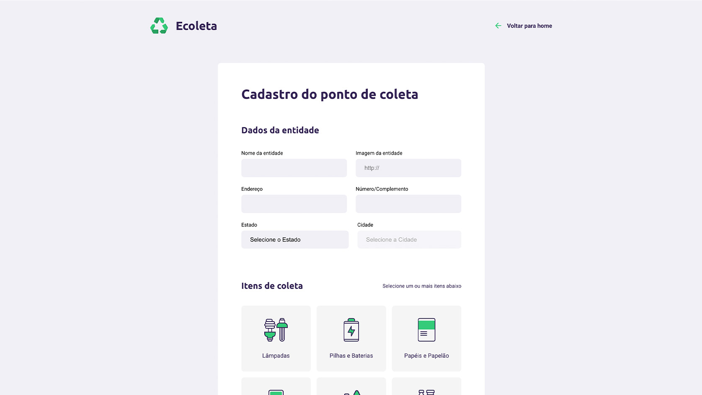

# :computer: ecoleta

## :memo: Sobre o Projeto 
### Português: 
Site fictício de cadastro de locais de coleta de recicláveis.
Quase todas as etapas do CRUD aplicadas ao projeto, com exceção da delete.

### Inglês: 
Fictitious site for registering recyclable collection.
Almost all CRUD steps applied to the project, with the exception of delete.

## :octocat: Conhecimentos usados
### Português: 
Este projeto foi construído com a trindade básica de web e usando nunjucks, express e sqlite3.

### Inglês: 
This project was built with the basic web trinity and using nunjucks, express and sqlite3.